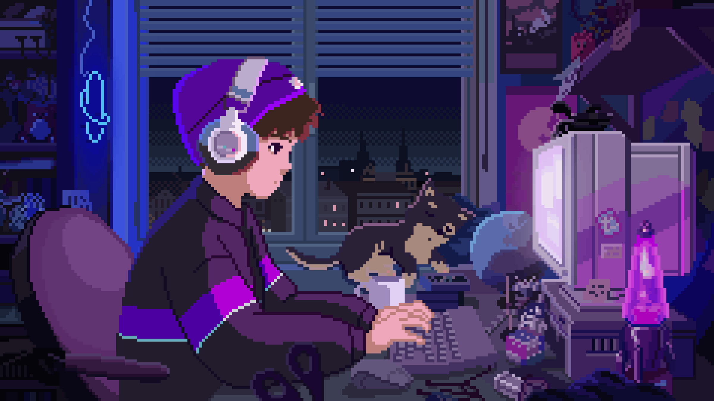

  <h1>Hello, I'm Jonas Cadoná 👋</h1>

  

<h3 align="center">
  FullStack Developer
</h3>

  
  

## About Me
-  Hello! My name is Jonas Cadoná, and I’m currently working as a Copywriter and exploring the world of programming. 
-  My focus is on creating creative solutions, both in persuasive writing and in developing digital projects. 
-  I’m learning JavaScript and Java as a self-taught programmer. 
-  I'm an introverted and welcoming person who loves talking about physics and computing. 
-  I am still learning, but I'm determined to contribute to projects to enhance my knowledge. 

#

## Toolset

  

#

## Contact Me

  
  

  
Credits

  <ul>
    <li>GitHub Stats by <a href="https://github.com/anuraghazra/github-readme-stats">anuraghazra</a></li>
  </ul>

