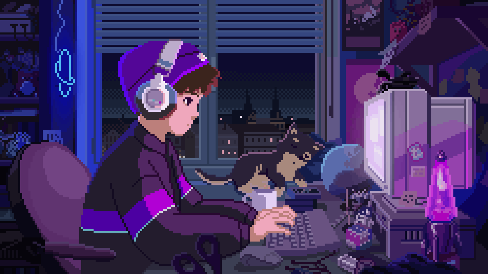

  <h1>Hello, I'm Jonas Cadoná 👋</h1>

-----

## 🔮 I’m currently working as a Copywriter and exploring the world of programming.
- ### My main focus is on creating creative solutions, both in persuasive writing and in developing digital projects. I’m currently building my first projects from scratch using JavaScript, HTML, and CSS 
----
## 🧠 I’m learning JavaScript and Java as a self-taught programmer

## 💻 I’m looking to collaborate on projects that combine creativity and technology. 
- ### I’m always seeking new opportunities to contribute innovative ideas and learn from others.
---
## 💡 Ask me about persuasive techniques, content creation, and sales strategies, or about getting started in the world of programming as a beginner.

## 📬 Reach me at [Linkedin](https://www.linkedin.com/in/jonas-eduardo-59154b339/) 

  <h1>My Technologies</h1>

  

 

          
